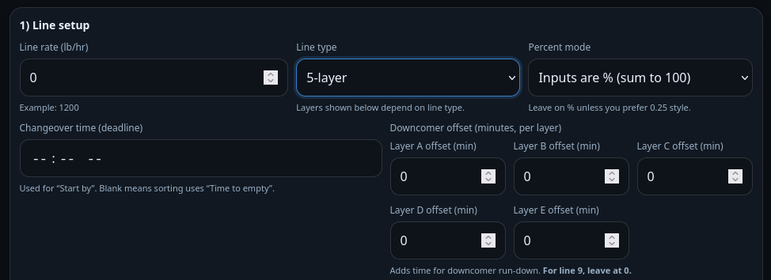

# Resin Timer 

## Description

Resin Timer is a lightweight, mobile-friendly, offline web app for blown film lines. Enter line rate, layer splits, hopper splits, and hopper weights to calculate time-to-empty and (optionally) “start by” times before a changeover—plus per-layer downcomer offsets. Results are sorted by the most urgent hopper and include a Pump Off checklist to track progress.

## How to use (quick tutorial)
**1) Open the app**
- Download or clone this repo.

- Open resin-timer-0_0##.html in any modern browser (Chrome, Safari, Edge, Firefox).

- Works offline after it’s loaded.

**2) Line setup**

- Line rate (lb/hr): Enter total line output. (e.g., 1200)

- Line type: Choose 1, 3, or 5 layers.

- Percent mode: Leave on % unless you prefer fractions.

- Changeover time (optional): Set a deadline time (e.g., 4:00PM).

- If set, Results sort by Start by.

- If blank, Results sort by Time to empty.

- Downcomer offset (minutes): Enter a per-layer offset to account for downcomer run-down time.

- Offset is added to the calculated run-down time.

- For line 9, leave at 0.

**3) Layer split**

- Enter the % of total line rate assigned to each layer (should total 100%).

- Example (3-layer): A=20, B=60, C=20

**4) Hopper splits + weights (per layer)**

- For each layer:

- Enter each hopper Split (% of that layer, should total 100%).

- Enter each hopper Weight (lb) (current resin in hopper).

- Tip: faster entry using Enter:

- Split → Weight → next Split

**5) Results**

- Results display a single combined list, sorted by the most urgent hopper.

- Each result includes:

- Hopper rate (lb/hr)

- Time to empty

- Total time (empty + downcomer offset)

- If changeover is set: Start by time

- Check Pump off when you’ve shut that hopper’s pump off — the row fades/greys out.

**6) Recipes (named configs)**

- Type a Config name → click Save / Update config.

- Export copies a JSON recipe you can share.

- Import pastes a JSON recipe and can load it.

  
  
**Notes**

Resin Timer autosaves locally in your browser (no network required).

“Show all hoppers” reveals incomplete entries with warning badges.
